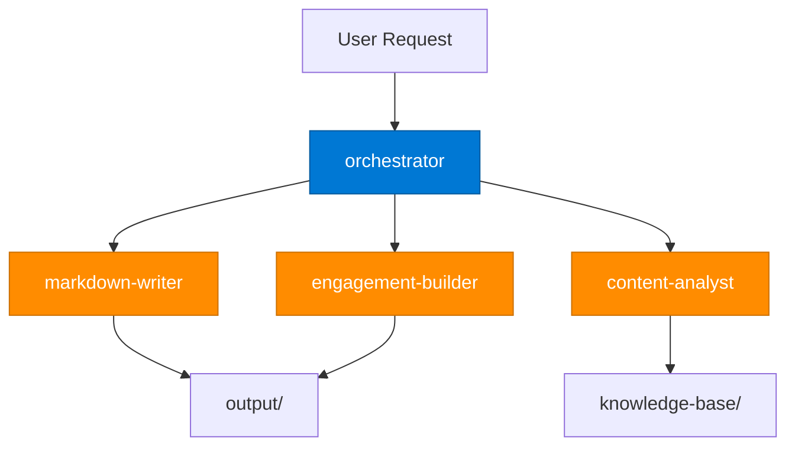

# {{FRAMEWORK_NAME}} — Methodology

## Table of Contents

- [Overview](#overview)
- [Phase 1: Discover](#phase-1-discover)
- [Phase 2: Plan](#phase-2-plan)
- [Phase 3: Build](#phase-3-build)
- [Phase 4: Validate](#phase-4-validate)
- [Phase 5: Deliver](#phase-5-deliver)
- [Agent Architecture](#agent-architecture)
- [Platform Stack](#platform-stack)
- [Governance Framework](#governance-framework)
- [ROI Model](#roi-model)
- [Engagement Model](#engagement-model)
- [Knowledge Base Index](#knowledge-base-index)
- [References](#references)

---

## Overview

### What

{{FRAMEWORK_WHAT}} — A structured, AI-assisted methodology for {{FRAMEWORK_DOMAIN}} that combines human expertise with multi-agent orchestration to deliver measurable outcomes.

### Who

{{FRAMEWORK_WHO}} — Target audience for this framework (e.g., consultants, architects, engineers, decision-makers).

### Why

{{FRAMEWORK_WHY}} — The business rationale for adopting this framework (e.g., reduce time-to-value, improve quality, ensure consistency).

### Scope

{{FRAMEWORK_SCOPE}} — What this framework covers and what it explicitly excludes.

---

## Phase 1: Discover

> **Goal**: {{PHASE_1_GOAL}}

| Attribute | Detail |
|-----------|--------|
| **Activities** | {{PHASE_1_ACTIVITIES}} |
| **Agents** | `orchestrator`, `content-analyst` |
| **Key Output** | {{PHASE_1_OUTPUT}} |
| **Duration** | {{PHASE_1_DURATION}} |

### Activities

1. {{PHASE_1_ACTIVITY_1}}
2. {{PHASE_1_ACTIVITY_2}}
3. {{PHASE_1_ACTIVITY_3}}

### Deliverables

- {{PHASE_1_DELIVERABLE_1}}
- {{PHASE_1_DELIVERABLE_2}}

---

## Phase 2: Plan

> **Goal**: {{PHASE_2_GOAL}}

| Attribute | Detail |
|-----------|--------|
| **Activities** | {{PHASE_2_ACTIVITIES}} |
| **Agents** | `orchestrator`, `engagement-builder` |
| **Key Output** | {{PHASE_2_OUTPUT}} |
| **Duration** | {{PHASE_2_DURATION}} |

### Activities

1. {{PHASE_2_ACTIVITY_1}}
2. {{PHASE_2_ACTIVITY_2}}
3. {{PHASE_2_ACTIVITY_3}}

### Deliverables

- {{PHASE_2_DELIVERABLE_1}}
- {{PHASE_2_DELIVERABLE_2}}

---

## Phase 3: Build

> **Goal**: {{PHASE_3_GOAL}}

| Attribute | Detail |
|-----------|--------|
| **Activities** | {{PHASE_3_ACTIVITIES}} |
| **Agents** | `orchestrator`, `markdown-writer`, `content-analyst` |
| **Key Output** | {{PHASE_3_OUTPUT}} |
| **Duration** | {{PHASE_3_DURATION}} |

### Activities

1. {{PHASE_3_ACTIVITY_1}}
2. {{PHASE_3_ACTIVITY_2}}
3. {{PHASE_3_ACTIVITY_3}}

### Deliverables

- {{PHASE_3_DELIVERABLE_1}}
- {{PHASE_3_DELIVERABLE_2}}

---

## Phase 4: Validate

> **Goal**: {{PHASE_4_GOAL}}

| Attribute | Detail |
|-----------|--------|
| **Activities** | {{PHASE_4_ACTIVITIES}} |
| **Agents** | `orchestrator`, `content-analyst` |
| **Key Output** | {{PHASE_4_OUTPUT}} |
| **Duration** | {{PHASE_4_DURATION}} |

### Activities

1. {{PHASE_4_ACTIVITY_1}}
2. {{PHASE_4_ACTIVITY_2}}
3. {{PHASE_4_ACTIVITY_3}}

### Deliverables

- {{PHASE_4_DELIVERABLE_1}}
- {{PHASE_4_DELIVERABLE_2}}

---

## Phase 5: Deliver

> **Goal**: {{PHASE_5_GOAL}}

| Attribute | Detail |
|-----------|--------|
| **Activities** | {{PHASE_5_ACTIVITIES}} |
| **Agents** | `orchestrator`, `engagement-builder`, `markdown-writer` |
| **Key Output** | {{PHASE_5_OUTPUT}} |
| **Duration** | {{PHASE_5_DURATION}} |

### Activities

1. {{PHASE_5_ACTIVITY_1}}
2. {{PHASE_5_ACTIVITY_2}}
3. {{PHASE_5_ACTIVITY_3}}

### Deliverables

- {{PHASE_5_DELIVERABLE_1}}
- {{PHASE_5_DELIVERABLE_2}}

---

## Agent Architecture

| Agent | Role | Phase Coverage | Primary Tools |
|-------|------|----------------|---------------|
| `orchestrator` | Coordinates all agents, routes tasks, ensures quality | All phases | Task routing, validation, workflow management |
| `markdown-writer` | Generates structured Markdown deliverables | Phase 3, 5 | Document generation, frontmatter management, versioning |
| `engagement-builder` | Produces client-facing proposals and business cases | Phase 2, 5 | Template scaffolding, ROI calculation, engagement profiling |
| `content-analyst` | Analyzes sources, extracts insights, populates knowledge base | Phase 1, 3, 4 | Document reading, content extraction, knowledge indexing |

### Agent Interaction Flow



---

## Platform Stack

| Layer | Technology | Purpose |
|-------|------------|---------|
| AI Orchestration | GitHub Copilot + Claude Code | Dual-platform agent execution |
| Knowledge Store | Markdown files in `knowledge-base/` | Structured domain knowledge |
| Source Ingestion | Python scripts (`sources/scripts/`) | Read and extract content from binary documents |
| Automation | Makefile | Workspace commands: setup, validate, index, bump, read |
| Version Control | Git + GitHub | Change tracking, collaboration, CI/CD |
| Document Format | Markdown with YAML frontmatter | Primary deliverable format |
| Export Formats | PDF, PPTX, DOCX, HTML | Secondary output formats |
| {{ADDITIONAL_PLATFORM}} | {{ADDITIONAL_TECH}} | {{ADDITIONAL_PURPOSE}} |

---

## Governance Framework

### Tier 1: Strategic Governance

| Element | Description |
|---------|-------------|
| **Scope** | {{GOVERNANCE_T1_SCOPE}} |
| **Cadence** | {{GOVERNANCE_T1_CADENCE}} |
| **Stakeholders** | {{GOVERNANCE_T1_STAKEHOLDERS}} |
| **Decisions** | {{GOVERNANCE_T1_DECISIONS}} |

### Tier 2: Tactical Governance

| Element | Description |
|---------|-------------|
| **Scope** | {{GOVERNANCE_T2_SCOPE}} |
| **Cadence** | {{GOVERNANCE_T2_CADENCE}} |
| **Stakeholders** | {{GOVERNANCE_T2_STAKEHOLDERS}} |
| **Decisions** | {{GOVERNANCE_T2_DECISIONS}} |

### Tier 3: Operational Governance

| Element | Description |
|---------|-------------|
| **Scope** | {{GOVERNANCE_T3_SCOPE}} |
| **Cadence** | {{GOVERNANCE_T3_CADENCE}} |
| **Stakeholders** | {{GOVERNANCE_T3_STAKEHOLDERS}} |
| **Decisions** | {{GOVERNANCE_T3_DECISIONS}} |

---

## ROI Model

| Metric | Baseline | Target | Measurement Method |
|--------|----------|--------|--------------------|
| {{ROI_METRIC_1}} | {{BASELINE_1}} | {{TARGET_1}} | {{METHOD_1}} |
| {{ROI_METRIC_2}} | {{BASELINE_2}} | {{TARGET_2}} | {{METHOD_2}} |
| {{ROI_METRIC_3}} | {{BASELINE_3}} | {{TARGET_3}} | {{METHOD_3}} |
| {{ROI_METRIC_4}} | {{BASELINE_4}} | {{TARGET_4}} | {{METHOD_4}} |

### ROI Calculation Template

```
Total Investment    = {{TOTAL_INVESTMENT}}
Annual Savings      = {{ANNUAL_SAVINGS}}
Payback Period      = {{PAYBACK_PERIOD}}
3-Year ROI          = {{THREE_YEAR_ROI}}
```

---

## Engagement Model

### Step 1: Assess

Evaluate the client's current state, readiness, and strategic objectives. Map findings to the framework phases.

- **Input**: {{ASSESS_INPUT}}
- **Output**: {{ASSESS_OUTPUT}}
- **Duration**: {{ASSESS_DURATION}}

### Step 2: Customize

Tailor the framework methodology to the client's specific context, constraints, and priorities.

- **Input**: {{CUSTOMIZE_INPUT}}
- **Output**: {{CUSTOMIZE_OUTPUT}}
- **Duration**: {{CUSTOMIZE_DURATION}}

### Step 3: Pilot

Execute a scoped pilot engagement to validate the approach and demonstrate value.

- **Input**: {{PILOT_INPUT}}
- **Output**: {{PILOT_OUTPUT}}
- **Duration**: {{PILOT_DURATION}}

### Step 4: Scale

Expand the framework across the organization based on pilot results and lessons learned.

- **Input**: {{SCALE_INPUT}}
- **Output**: {{SCALE_OUTPUT}}
- **Duration**: {{SCALE_DURATION}}

---

## Knowledge Base Index

| Theme | Description | Key Documents |
|-------|-------------|---------------|
| `{{THEME_1}}/` | {{THEME_1_DESCRIPTION}} | — |
| `{{THEME_2}}/` | {{THEME_2_DESCRIPTION}} | — |
| `{{THEME_N}}/` | {{THEME_N_DESCRIPTION}} | — |

> Run `make index` to see current document counts and coverage.

---

## References

- [README.md](README.md) — Workspace overview and entry point
- [AGENTS.md](AGENTS.md) — Agent rules and workspace structure
- [CLAUDE.md](CLAUDE.md) — Claude Code session brief
- [CONTRIBUTING.md](CONTRIBUTING.md) — Editorial policy and contribution guidelines
- [CHANGELOG.md](CHANGELOG.md) — Version history
- [templates/FRAMEWORK_SCAFFOLD.md](templates/FRAMEWORK_SCAFFOLD.md) — Framework scaffold guide
