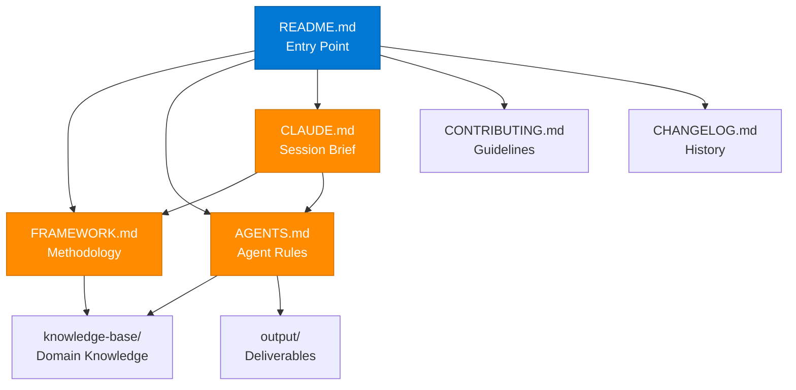

# {{FRAMEWORK_NAME}}

{{FRAMEWORK_DESCRIPTION}}

This workspace provides a **template-driven, AI-assisted framework** for building structured knowledge bases, generating professional deliverables, and orchestrating multi-agent workflows across GitHub Copilot and Claude Code.

---

## Table of Contents

- [Quick Start](#quick-start)
- [Commands](#commands)
- [Project Structure](#project-structure)
- [Knowledge Base Themes](#knowledge-base-themes)
- [AI Primitives — Dual-Platform](#ai-primitives--dual-platform)
- [Agents](#agents)
- [Slash Commands](#slash-commands)
- [Document Map](#document-map)
- [How to Use This Template](#how-to-use-this-template)
- [References](#references)
- [Author](#author)

---

## Quick Start

```bash
# 1. Install dependencies
make setup

# 2. Validate workspace integrity
make validate

# 3. Explore the knowledge base
make index

# 4. Read any document (PDF, PPTX, DOCX, XLSX, MD)
make read FILE=path/to/file
```

---

## Commands

| Command | Description |
|---------|-------------|
| `make help` | Show all available commands |
| `make setup` | Install Python dependencies in `.venv` |
| `make validate` | Validate workspace integrity (frontmatter, markdown-first, structure) |
| `make validate-json` | Validate workspace with JSON output |
| `make bump FILE=... LEVEL=...` | Bump document version (patch, minor, major) |
| `make bump-dry FILE=... LEVEL=...` | Dry-run version bump |
| `make read FILE=...` | Read a document (PPTX, PDF, DOCX, XLSX, MD) |
| `make read-json FILE=...` | Read a document as JSON |
| `make index` | List all active knowledge-base documents with counts per theme |
| `make new-engagement CLIENT=...` | Scaffold a new client engagement |
| `make new-framework NAME=...` | Scaffold a new framework workspace |
| `make clean` | Remove generated artifacts (.venv, __pycache__) |

---

## Project Structure

```
{{FRAMEWORK_NAME}}/
|
|-- .claude/                          # Claude Code configuration
|   |-- settings.json                 # Project-level Claude settings
|   |-- agents/                       # Claude Code agent definitions
|   |-- skills/                       # Claude Code skill files
|   |-- rules/                        # Claude Code rule files
|
|-- .github/                          # GitHub Copilot & Actions configuration
|   |-- agents/                       # GitHub Copilot agent definitions
|   |-- instructions/                 # GitHub Copilot instructions
|   |-- prompts/                      # Reusable prompt files
|   |-- skills/                       # GitHub Copilot skill files
|
|-- knowledge-base/                   # Core framework knowledge
|   |-- {{THEME_1}}/                  # Theme folder (domain-specific)
|   |-- {{THEME_2}}/                  # Theme folder (domain-specific)
|   |-- {{THEME_N}}/                  # Additional theme folders
|   |-- archive/                      # Deprecated content
|
|-- sources/                          # Reference materials and research
|   |-- decks/                        # Slide decks (PPTX, PDF)
|   |-- pdfs/                         # PDF documents
|   |-- images/                       # Visual assets (PNG, SVG, JPG)
|   |-- docs/                         # Word documents, spreadsheets
|   |-- scripts/                      # Automation scripts
|
|-- templates/                        # Reusable document templates
|   |-- DOCUMENT_TEMPLATE.md          # Standard document template
|   |-- IMAGE_MIRROR_TEMPLATE.md      # Image mirror template
|   |-- FRAMEWORK_SCAFFOLD.md         # Framework scaffold guide
|
|-- output/                           # Generated deliverables
|   |-- md/                           # Markdown output (primary)
|   |-- pdf/                          # PDF exports
|   |-- pptx/                         # PowerPoint exports
|   |-- docx/                         # Word exports
|   |-- html/                         # HTML exports
|
|-- README.md                         # This file — workspace overview
|-- FRAMEWORK.md                      # Framework methodology (source of truth)
|-- AGENTS.md                         # Agent rules and workspace structure
|-- CLAUDE.md                         # Claude Code session brief
|-- CONTRIBUTING.md                   # Contribution guidelines
|-- CHANGELOG.md                      # Version history
|-- LICENSE                           # License file
|-- Makefile                          # Workspace automation
```

---

## Knowledge Base Themes

| Theme Folder | Description | Documents |
|--------------|-------------|-----------|
| `{{THEME_1}}/` | {{THEME_1_DESCRIPTION}} | — |
| `{{THEME_2}}/` | {{THEME_2_DESCRIPTION}} | — |
| `{{THEME_N}}/` | {{THEME_N_DESCRIPTION}} | — |
| `archive/` | Deprecated or superseded content | — |

> Run `make index` to see current document counts per theme.

---

## AI Primitives — Dual-Platform

This framework uses a dual-platform AI architecture: **GitHub Copilot** for IDE-integrated workflows and **Claude Code** for CLI-driven orchestration. Both platforms share the same knowledge base and follow the same conventions.

### GitHub Copilot

| Primitive | Count | Location | Description |
|-----------|-------|----------|-------------|
| Agents | 4 | `.github/agents/` | Agent definitions (`.agent.md`) |
| Skills | 4 | `.github/skills/` | Domain skill files (`SKILL.md`) |
| Prompts | 6 | `.github/prompts/` | Slash command prompts (`.prompt.md`) |
| Instructions | 3 | `.github/instructions/` | Behavioral rules (`.instructions.md`) |

### Claude Code

| Primitive | Count | Location | Description |
|-----------|-------|----------|-------------|
| Agents | 4 | `.claude/agents/` | Agent definitions (`.agent.md`) |
| Skills | 4 | `.claude/skills/` | Domain skill files (`SKILL.md`) |
| Prompts | 6 | `.claude/commands/` | Custom slash commands (`.md`) |
| Rules | 3 | `.claude/rules/` | Behavioral rules (`.md`) |

---

## Agents

| Agent | Role | Platform | Description |
|-------|------|----------|-------------|
| `orchestrator` | Coordinator | Both | Routes tasks to specialized agents, manages workflow execution, ensures deliverable quality |
| `markdown-writer` | Content Creator | Both | Generates structured Markdown documents with proper frontmatter, versioning, and cross-references |
| `engagement-builder` | Client Delivery | Both | Scaffolds client engagements, produces tailored proposals, business cases, and assessment reports |
| `content-analyst` | Knowledge Analyst | Both | Analyzes source materials (decks, PDFs, docs), extracts key insights, and populates the knowledge base |

---

## Slash Commands

| Command | Description | Agent |
|---------|-------------|-------|
| `/onboard-client` | Scaffold a new client engagement with discovery templates | `engagement-builder` |
| `/markdown` | Generate a structured Markdown document from a brief | `markdown-writer` |
| `/build-business-case` | Create a business case document with ROI analysis | `engagement-builder` |
| `/analyze-source` | Extract and index content from a source document | `content-analyst` |
| `/validate` | Run workspace validation and report issues | `orchestrator` |
| `/review` | Review a document for quality, completeness, and compliance | `orchestrator` |

---

## Document Map

The root files form an interconnected documentation system:



| File | Purpose | Reads From | Feeds Into |
|------|---------|------------|------------|
| `README.md` | Entry point and overview | All root files | Users, contributors |
| `FRAMEWORK.md` | Methodology definition (source of truth) | `knowledge-base/` | `AGENTS.md`, deliverables |
| `AGENTS.md` | Agent rules and workspace conventions | `FRAMEWORK.md` | All agents, `CLAUDE.md` |
| `CLAUDE.md` | Claude Code session brief | `FRAMEWORK.md`, `AGENTS.md` | Claude Code sessions |
| `CONTRIBUTING.md` | Editorial and contribution rules | `README.md` | Contributors |
| `CHANGELOG.md` | Version history | All changes | Release tracking |

---

## How to Use This Template

### Step 1: Create Your Repository

```bash
gh repo create {{YOUR_ORG}}/{{YOUR_FRAMEWORK}} --template {{TEMPLATE_REPO}} --public
cd {{YOUR_FRAMEWORK}}
```

### Step 2: Configure Your Framework

1. Replace all `{{PLACEHOLDER}}` variables in root files with your domain-specific values.
2. Update `FRAMEWORK.md` with your methodology phases, principles, and lifecycle.
3. Define your knowledge base themes by creating folders under `knowledge-base/`.

### Step 3: Set Up AI Primitives

1. Create agent definitions in `.github/agents/` and `.claude/agents/`.
2. Define skills in `.github/skills/` and `.claude/skills/`.
3. Add prompts in `.github/prompts/` and `.claude/commands/`.
4. Configure rules in `.github/instructions/` and `.claude/rules/`.

### Step 4: Populate the Knowledge Base

1. Add source materials to `sources/` (decks, PDFs, images, docs).
2. Use `make read FILE=...` to extract content from source documents.
3. Create Markdown knowledge articles in the appropriate `knowledge-base/` theme folders.

### Step 5: Validate and Iterate

```bash
make validate    # Check workspace integrity
make index       # Review knowledge base coverage
```

### Step 6: Start Delivering

```bash
make new-engagement CLIENT=clientname    # Scaffold a client engagement
```

---

## References

- [FRAMEWORK.md](FRAMEWORK.md) — 5-phase methodology definition
- [AGENTS.md](AGENTS.md) — Agent rules, workspace structure, naming conventions
- [CLAUDE.md](CLAUDE.md) — Claude Code session brief and workspace conventions
- [CONTRIBUTING.md](CONTRIBUTING.md) — Editorial policy and contribution guidelines
- [CHANGELOG.md](CHANGELOG.md) — Version history
- [templates/FRAMEWORK_SCAFFOLD.md](templates/FRAMEWORK_SCAFFOLD.md) — Full scaffold guide for new workspaces
- [Keep a Changelog](https://keepachangelog.com/) — Changelog format standard
- [Semantic Versioning](https://semver.org/) — Versioning standard

---

## Author

**{{AUTHOR}}**
{{AUTHOR_TITLE}} | {{AUTHOR_ORG}}

- GitHub: [{{GITHUB_HANDLE}}](https://github.com/{{GITHUB_HANDLE}})
- LinkedIn: [{{LINKEDIN_HANDLE}}](https://linkedin.com/in/{{LINKEDIN_HANDLE}})
